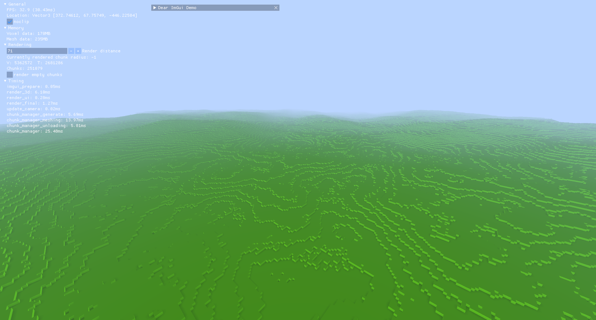
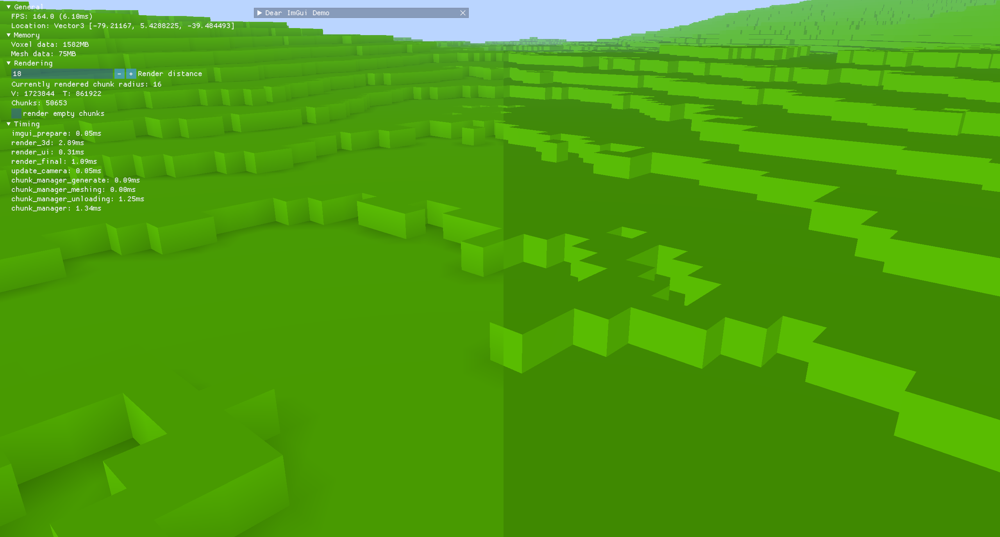
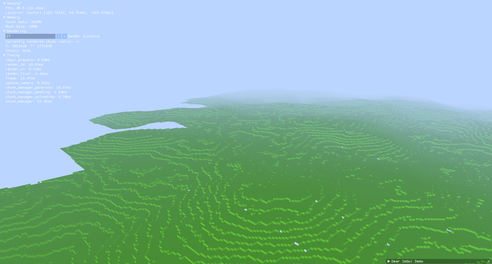

# 🚀A custom voxel engine written in Rust

A very basic voxel engine using WGPU as a rendering library.
The goal of this project is to be able to render lots of voxels with (almost unique) properties such as a color for
every voxel.

## Planned features

- Raytracing using compute shaders (or Vulkan Raytracing)
- PBR: Physically based rendering
- Collision so the user can walk
- Ability to edit the world such as by placing and breaking a lot of blocks at once (this data manipulation may also be done using compute shaders)
- Efficient world persistence
- Fast world generation on the GPU using compute shaders

## Where will this go?

Some possibilities for what this voxel engine could turn into include:

- Visualization of fluid simulations
- Realistic procedural world generation
- An adventure game
- A highly-configurable voxel engine with focus on performance

## Milestone showcases

### Large amount of concurrent loaded chunks

*A huge amount of chunks can be loaded at once. This is because one chunk only stores data for every contained voxel, if
the voxels are of different types.*

### Ambient Occlusion

*Ambient Occlusion is enabled on the left image. It is a per-vertex value describing the amount of nearby occluding
blocks. This value is then used in the shader to darken the affected areas and simulate a soft shadow.*

### Adaptive chunk loading

*Here is an overview over a procedurally generated world. The chunks inside a specific radius around the camera are
loaded. They stay loaded until they reach a certain unload threshold -- the maximum render distance. (In this image are
also some visible holes in the mesh between two chunk borders.)* 
